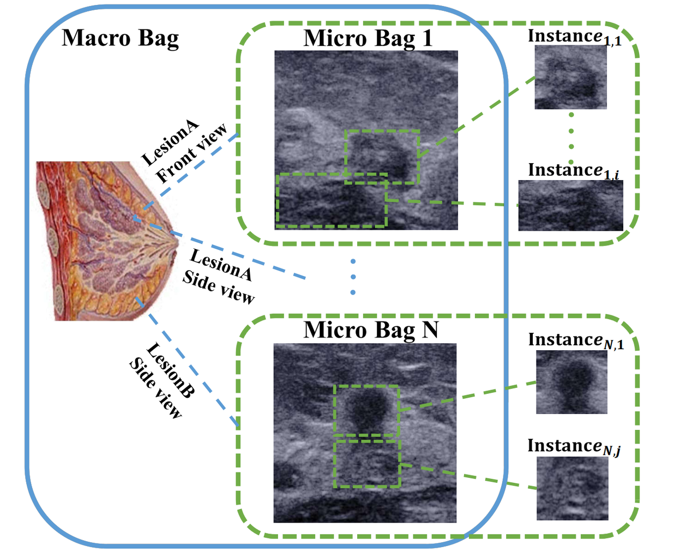

# Hierarchical Multiple Instance Learning with Spatial-aware Pooling for Breast Diagnosis  

This repository provides a PyTorch implementation of HMILS (Hierarchical Multiple Instance Learning with Spatial-aware pooling). See details at ...

In this hierarchical framework, a patient is a macro-level bag comprised of multiple ultrasound images representing different views of lesions as instances and an ultrasound image is considered as a macro bag and decomposed into several sub-regions representing different views of lesions as instances.

Experiments are conducted on two datasets. Our in-house dataset will be released after review, while another public dataset BACH is available [here](https://iciar2018-challenge.grand-challenge.org/dataset/).

## Run
In our code [PyTorch Geometric](https://pytorch-geometric.readthedocs.io/en/latest/notes/installation.html) is required. Please make sure PyTorch Geometric version matches PyTorch and CUDA driver version.

    python main.py --data_root [data path] --log_root [log path] --test_fold [data fold for eval] --task [BM or ALNM] --t [threshold coef for graph]

## Licecnse
This repository is released under the MIT license as in the [LICENSE]() file.

## Citation
If you find our work useful, please kindly considering cite the following paper.

